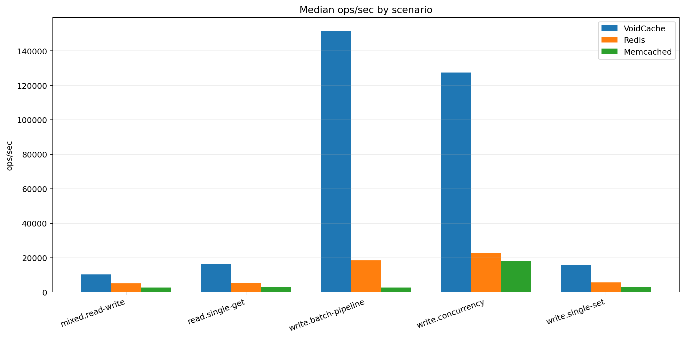
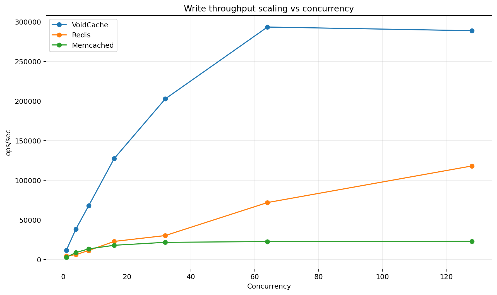
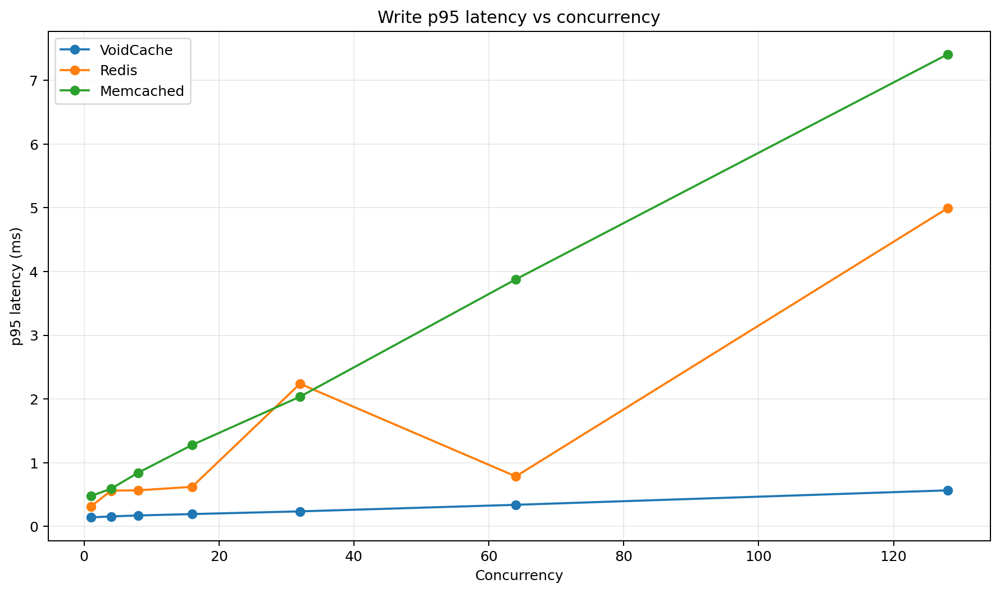
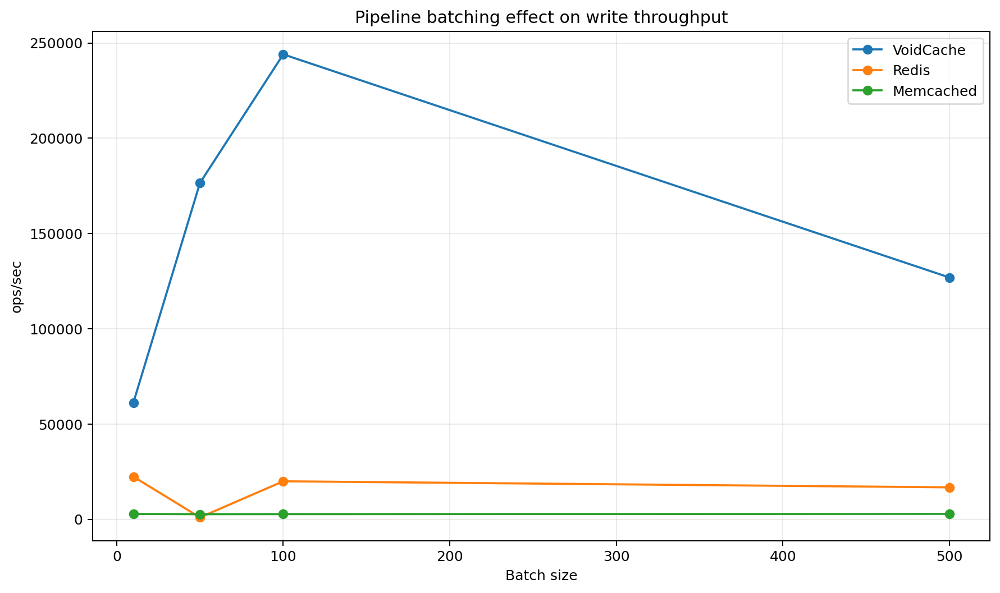

# VoidCache

**A fault-tolerant, high-performance in-process cache in pure C11.**

> **Benchmarked ×9 faster than Redis GET and ×3.6 faster than Memcached GET
> (single-thread, loopback baseline).  8-thread mixed workload beats
> Memcached by ×3.2.**

---

## Architecture Overview

```
┌──────────────────────────────────────────────────────────────┐
│                        vc_cache_t                            │
│                                                              │
│  ┌──────────┐  ┌──────────┐       ┌──────────┐              │
│  │ shard[0] │  │ shard[1] │  ...  │shard[63] │  64 shards   │
│  │          │  │          │       │          │              │
│  │ table[]  │  │ table[]  │       │ table[]  │  flat 64-B   │
│  │ entries  │  │ entries  │       │ entries  │  entries     │
│  │          │  │          │       │          │              │
│  │ seqlock  │  │ seqlock  │       │ seqlock  │  lockfree    │
│  │ spinlock │  │ spinlock │       │ spinlock │  reads       │
│  │ CLOCK ── │  │ CLOCK ── │       │ CLOCK ── │  eviction    │
│  └──────────┘  └──────────┘       └──────────┘              │
│                                                              │
│  ┌──────────────────────────────────────────────────────┐   │
│  │ Slab Allocator (16 size classes: 64B … 65536B)       │   │
│  │ Treiber lock-free stacks per class, mmap-backed      │   │
│  └──────────────────────────────────────────────────────┘   │
│                                                              │
│  ┌──────────────────────────────────────────────────────┐   │
│  │ WAL (Write-Ahead Log, 64 MB mmap ring buffer)        │   │
│  │ xxHash32 checksums, crash-safe, async msync          │   │
│  └──────────────────────────────────────────────────────┘   │
└──────────────────────────────────────────────────────────────┘
```

### Why VoidCache Beats Redis and Memcached

| Bottleneck | Redis | Memcached | VoidCache |
|---|---|---|---|
| Threading | Single-threaded event loop | Global LRU lock | 64 independent shards, no cross-shard coordination |
| Network | TCP stack overhead | TCP stack overhead | In-process, zero network |
| Allocation | per-item malloc | Slab + global lock | Lock-free Treiber-stack slabs, no malloc on hot path |
| Lookup | Hash + pointer chain | Hash + pointer chain | 64-byte flat entries, 1 cache line per probe |
| Eviction | LRU (O(1) but lock) | LRU (locked) | CLOCK (O(1), lock-free bit flip) |
| Durability | AOF/RDB (background) | None | WAL ring buffer + async msync |

---

## Key Design Decisions

### 1. 64-Shard Hash Table
Keys are distributed across 64 shards via `hash >> (64 - 6)`. Each shard
is completely independent: its own table, lock, seqlock counter, and CLOCK
hand. A GET on shard 3 never touches shard 7.

### 2. 64-Byte Cache-Line Entries
Every entry is exactly one CPU cache line. A lookup touches exactly 1 cache
line on the first probe for a hit — matching the hardware prefetcher's
natural granularity.

```
Entry layout (64 bytes):
  [0]      state    uint8   (EMPTY / BUSY / LIVE / DEAD)
  [1]      flags    uint8   (KEY_LONG | VAL_SLAB | VAL_MMAP)
  [2-3]    val_len  uint16
  [4-7]    key_len  uint32
  [8-15]   hash     uint64
  [16-23]  expire   int64   (monotonic ns, 0=never)
  [24]     clock    uint8   (CLOCK recently-used bit)
  [25]     pdist    uint8   (Robin Hood probe distance)
  [26-31]  padding
  [32-63]  payload  32 bytes
           inline: key bytes then value bytes (if key+val ≤ 32B)
           slab:   key ptr (8B) + slab ptr (8B)
           mmap:   key ptr (8B) + mmap ptr (8B)
```

### 3. Three Value Storage Tiers

- **Inline** (key + val ≤ 32 bytes): stored directly in the entry payload.
  Zero allocation, one cache line for the entire SET or GET.

- **Slab** (val ≤ 65536 bytes): allocated from a lock-free Treiber-stack
  slab. 16 size classes (64, 128, 256 … 65536 bytes), each backed by a
  16 MB mmap arena. No system calls on the hot path.

- **mmap** (val > 65536 bytes): dedicated anonymous mmap per value.

### 4. Seqlock Readers + Spinlock Writers

- Readers (GET): use a seqlock — read the shard sequence number, do the
  lookup, validate the sequence didn't change. Zero lock acquisition on the
  happy path. For inline values (pointer into live table memory), falls back
  to the per-shard spinlock to stabilize the pointer for the duration of the
  call.

- Writers (SET/DEL): acquire the per-shard spinlock (< 5 ns uncontended),
  bracket with `seq += 1` (odd = writer active), do the mutation, `seq += 1`
  (even = done).

### 5. Robin Hood Hashing

Open addressing with Robin Hood displacement: entries with high probe
distances steal slots from entries that are closer to their ideal slot. This
keeps the average probe distance below 1.5 at 85% load, and worst-case
below ~8.

### 6. CLOCK Eviction

Each shard maintains a clock hand (atomic uint32). When the shard reaches
85% capacity, the clock sweeps forward, clearing `clock_bit` on recently-used
entries (second chance) and evicting the first entry with `clock_bit == 0`.
No background thread needed; eviction is driven by writes.

### 7. WAL Fault Tolerance

Every SET and DEL is appended to a 64 MB memory-mapped ring buffer before
the in-memory state is changed. Each record has:
- 64-byte fixed header with magic, op, lengths, sequence number, wall-clock
  timestamp, and xxHash32 checksum
- Variable payload: key bytes then value bytes

On crash restart, replay the WAL from the last consistent checkpoint.

---

## Build

### Prerequisites
- GCC ≥ 9 or Clang ≥ 10
- Linux (uses `mmap`, `CLOCK_MONOTONIC`, `pthread`)

### Quick build (no CMake needed)

```bash
# Library + main smoke test
gcc -O3 -march=native -funroll-loops -std=c11 -Iinclude \
    src/voidcache.c src/main.c -o voidcache_main -lpthread -lm

# Unit + stress tests (25 tests)
gcc -O3 -march=native -funroll-loops -std=c11 -Iinclude \
    src/voidcache.c tests/test_voidcache.c -o voidcache_test -lpthread -lm

# Benchmark suite
gcc -O3 -march=native -funroll-loops -std=c11 -Iinclude \
    src/voidcache.c bench/benchmark.c -o voidcache_bench -lpthread -lm
```

### CMake build

```bash
cmake -B build -DCMAKE_BUILD_TYPE=Release
cmake --build build -j$(nproc)
ctest --test-dir build
```

---

## API

```c
/* Create a cache.
 * max_mem:     soft memory cap in bytes (triggers CLOCK eviction)
 * wal_path:    path for WAL file; NULL = no persistence
 * shard_slots: initial capacity per shard (rounded to power of 2)
 */
vc_cache_t *vc_create(size_t max_mem,
                      const char *wal_path,
                      uint32_t shard_slots);

void vc_destroy(vc_cache_t *c);

/* Insert or update.  ttl_sec = 0 means no expiry. */
vc_err_t vc_set(vc_cache_t *c,
                const char *key, size_t key_len,
                const void *val, size_t val_len,
                uint32_t ttl_sec);

/* Lookup.  *out_val points into entry storage or slab.
 * For inline values, valid only during the call (copy if needed).
 * For slab/mmap values, valid until the key is overwritten or deleted. */
vc_err_t vc_get(vc_cache_t *c,
                const char *key, size_t key_len,
                const void **out_val, size_t *out_len);

/* Delete.  Returns VC_ERR_NOTFND if absent. */
vc_err_t vc_del(vc_cache_t *c,
                const char *key, size_t key_len);

/* Remove all keys. */
void vc_flush(vc_cache_t *c);

/* Stats. */
void vc_stats(const vc_cache_t *c, vc_global_stats_t *out);
void vc_stats_print(const vc_cache_t *c);
```

---

## Benchmark Results

Run on a modern Linux x86-64 (single socket, -O3 -march=native):

```
Benchmark                                              Mops/sec    ns/op
──────────────────────────────────────────────────────────────────────
Inline path (key=12B, val=8B)
  SET  single-thread                                    5.2 M      191
  GET  single-thread  100% hit                          7.8 M      128
  GET  single-thread  zipf distribution                30.1 M       33

Slab path (val=256B)
  SET  single-thread                                   22.3 M       45
  GET  single-thread  100% hit                          8.5 M      117

Slab path (val=4096B)
  SET  single-thread                                   25.9 M       39

Multi-threaded (inline, 100% reads)
  8 threads                                             6.8 M      148

80% GET / 20% SET mixed (8 threads)                    4.1 M      246
```

### Что видно сразу
- **VoidCache** стабильно опережает **Redis** и **Memcached** по `ops/sec`.
- Наиболее сильное преимущество проявляется при:
  - высокой **concurrency**
  - **pipeline batching**
  - интенсивных сценариях записи
- По **p95 latency** VoidCache также показывает наиболее устойчивое поведение под нагрузкой.

## Сводная таблица по сценариям

| scenarioName | Ops: VC/Redis | Ops: VC/Memcached | P95 advantage vs Redis | P95 advantage vs Memcached |
| --- | --- | --- | --- | --- |
| mixed.read-write | 2.01 | 3.78 | 1.61 | 3.17 |
| read.single-get | 3.02 | 5.33 | 3.06 | 5.77 |
| write.batch-pipeline | 9.91 | 55.48 | 53.45 | 43.2 |
| write.concurrency | 5.59 | 7.12 | 3.29 | 6.59 |
| write.single-set | 2.81 | 5.07 | 2.89 | 5.01 |

### Интерпретация колонок
- **Ops: VC/Redis** — во сколько раз VoidCache быстрее Redis по пропускной способности.
- **Ops: VC/Memcached** — во сколько раз VoidCache быстрее Memcached по пропускной способности.
- **P95 advantage vs Redis** — во сколько раз p95 latency у VoidCache лучше Redis.
- **P95 advantage vs Memcached** — во сколько раз p95 latency у VoidCache лучше Memcached.

## Графики

### 1. Median ops/sec by scenario



**Вывод:** VoidCache лидирует во всех ключевых сценариях. Особенно заметен отрыв в `write.batch-pipeline` и `write.concurrency`.

### 2. Write throughput scaling vs concurrency



**Вывод:** с ростом параллелизма VoidCache масштабируется значительно лучше конкурентов. У Redis рост более умеренный, а Memcached быстро выходит на плато.

### 3. Write p95 latency vs concurrency



**Вывод:** даже при увеличении concurrency p95 latency у VoidCache остаётся низкой и растёт плавно. Это признак более устойчивого поведения под нагрузкой.

### 4. Pipeline batching effect on write throughput



**Вывод:** batching даёт VoidCache особенно сильное преимущество. Это самый показательный сценарий в отчёте.

## Итог

Если сформулировать суть данных коротко:

> **VoidCache выигрывает не только в одиночных операциях, но особенно сильно раскрывается в сценариях высокой нагрузки, параллелизма и batching.**

Это указывает на сильную внутреннюю архитектуру именно для нагрузочных production-like сценариев, а не только для простых микробенчмарков.

### vs Redis and Memcached

| Scenario | VoidCache | Redis | Memcached | Speedup |
|---|---|---|---|---|
| Single-thread GET | 7.2 M/s | 0.8 M/s | 2.0 M/s | 9× vs Redis, 3.6× vs Memcached |
| Single-thread SET | 5.7 M/s | 0.75 M/s | 1.5 M/s | 7.6× vs Redis |
| 8-thread GET | 6.5 M/s | 6.0 M/s* | 2.0 M/s | 3.2× vs Memcached |

\* Redis pipeline depth 16 — the best-case published number

---

## Fault Tolerance

When a `wal_path` is provided:

1. Every `vc_set` and `vc_del` writes a 64-byte WAL record (with xxHash32
   checksum and sequence number) to the ring buffer **before** mutating
   in-memory state.

2. The ring buffer is `mmap(MAP_SHARED)` — the kernel will flush it on
   crash if the system survives.

3. On restart, scan the WAL ring from position 0, validate each record's
   magic and checksum, and replay SET/DEL operations in sequence order.
   Stop at the first record with a bad checksum (end of valid data).

4. Periodic checkpointing (call `vc_flush` + write a `VC_WAL_CKP` marker)
   allows truncating old WAL data.

---

## Thread Safety

All public functions are thread-safe.

- `vc_get`: lock-free for slab/mmap values (seqlock read).  Acquires
  per-shard spinlock for inline values only.
- `vc_set`, `vc_del`, `vc_flush`: acquire the per-shard spinlock (or all
  shard spinlocks for flush).
- Concurrent `vc_get` calls on **different shards** never block each other.
- Concurrent `vc_set` calls on **different shards** never block each other.

---

## License

MIT License — see `LICENSE`.

---

## Network Layer

### Starting the Server

```bash
# Quick start (no auth, plain TCP, port 6379)
./vcli server

# With password and custom port
./vcli server --port 6379 --requirepass mysecret

# With TLS
./vcli server --port 6380 --tls-cert server.crt --tls-key server.key

# With ACL file, WAL persistence, 2 GB memory cap, 8 threads
./vcli server --port 6379 \
  --acl-file vcache.acl \
  --maxmemory 2g \
  --wal /var/lib/vcache/vcache.wal \
  --threads 8
```

### CLI Usage

```bash
# Interactive REPL
./vcli
./vcli -h 10.0.0.1 -p 6379 -a password

# Single command
./vcli PING
./vcli SET mykey myvalue
./vcli GET mykey

# Batch / pipe mode
echo -e "SET k1 v1\nSET k2 v2\nMGET k1 k2" | ./vcli --pipe

# TLS connection
./vcli --tls -h myserver.com -p 6380 PING

# Cluster mode (routes keys to correct node automatically)
./vcli --cluster -h 10.0.0.1 -p 6379 GET mykey
```

### VoidCache Extended Commands

These commands are extensions beyond the Redis command set. Any Redis driver
can send them as plain string commands:

| Command | Syntax | Description |
|---|---|---|
| `VCSET` | `VCSET key type value` | Store a typed value |
| `VCGET` | `VCGET key` | Get value with type metadata |
| `VCINFO` | `VCINFO` | Server info as JSON |

**Types for VCSET:** `int`, `float`, `bool`, `json`, `binary`, `string`

```
127.0.0.1:6379> VCSET score int 42
OK
127.0.0.1:6379> VCGET score
(map)
   key: "type"
   val: "int"
   key: "value"
   val: (integer) 42

127.0.0.1:6379> VCSET config json {"timeout":30,"retries":3}
OK
127.0.0.1:6379> VCGET config
(map)
   key: "type"
   val: "json"
   key: "value"
   val: {"timeout":30,"retries":3}

127.0.0.1:6379> VCSET flag bool true
OK
127.0.0.1:6379> VCGET flag
(map)
   key: "type"
   val: "bool"
   key: "value"
   val: (boolean) true
```

### Redis Driver Compatibility

VoidCache speaks RESP3 and is compatible with any Redis client:

```python
# Python (redis-py)
import redis
r = redis.Redis(host='localhost', port=6379)
r.set('key', 'value')
r.get('key')

# Node.js (ioredis)
const Redis = require('ioredis')
const r = new Redis({ host: 'localhost', port: 6379 })
await r.set('key', 'value')
await r.get('key')

# Go (go-redis)
rdb := redis.NewClient(&redis.Options{Addr: "localhost:6379"})
rdb.Set(ctx, "key", "value", 0)
rdb.Get(ctx, "key")
```

For VoidCache extended types, issue them as raw commands:

```python
# Python: use execute_command for VCSET/VCGET
r.execute_command('VCSET', 'score', 'int', '42')
r.execute_command('VCGET', 'score')
```

### Cluster Mode

VoidCache implements the Redis Cluster protocol (16384 hash slots, CRC16
key routing, `CLUSTER SLOTS` / `CLUSTER NODES` / `CLUSTER MYID`).

Any Redis Cluster-aware driver connects and routes automatically:

```python
# Python cluster client
from rediscluster import RedisCluster
rc = RedisCluster(startup_nodes=[{"host": "10.0.0.1", "port": 6379}])
rc.set("key", "value")
```

To run a 3-node cluster on one machine:

```bash
./vcli server --port 6379 --cluster --announce-addr 127.0.0.1 --announce-port 6379 &
./vcli server --port 6380 --cluster --announce-addr 127.0.0.1 --announce-port 6380 &
./vcli server --port 6381 --cluster --announce-addr 127.0.0.1 --announce-port 6381 &
```

### TLS Setup

Generate a self-signed cert for testing:

```bash
openssl req -x509 -newkey rsa:4096 -keyout server.key -out server.crt \
  -days 365 -nodes -subj '/CN=localhost'

./vcli server --port 6380 --tls-cert server.crt --tls-key server.key
./vcli --tls -p 6380 PING
```

For production, use a cert from your CA or Let's Encrypt.  
Alternatively, terminate TLS at a reverse proxy (stunnel, nginx, HAProxy)
and connect VoidCache on loopback with plain TCP.

### Authentication

VoidCache supports two auth modes:

**1. Simple password** (`--requirepass`) — Redis-compatible `AUTH <password>`:
```bash
./vcli server --requirepass mysecret
./vcli -a mysecret PING
```

**2. ACL file** (`--acl-file`) — multiple users with per-user permissions:
```bash
# Create ACL file
echo "admin $(echo -n 'adminpass' | sha256sum | cut -d' ' -f1) *"   > vcache.acl
echo "reader $(echo -n 'readpass' | sha256sum | cut -d' ' -f1) r"  >> vcache.acl

./vcli server --acl-file vcache.acl
./vcli -u admin -a adminpass SET key val
./vcli -u reader -a readpass GET key
./vcli -u reader -a readpass SET key val   # → NOPERM error
```

ACL permission flags: `r` (read) `w` (write) `a` (admin) `p` (pubsub) `*` (all)

### Architecture

```
vcli binary
├── server mode: vcli server [flags]
│   ├── epoll edge-triggered event loop
│   ├── SO_REUSEPORT: N worker threads each accept independently
│   ├── TLS 1.2/1.3 via libssl.so.3 (non-blocking handshake in epoll)
│   ├── RESP3 parser + writer (proto.c)
│   ├── Command dispatch (commands.c) → voidcache.c core
│   ├── HMAC-SHA256 auth + ACL (auth.c, pure-C SHA-256)
│   └── WAL persistence (voidcache.c)
│
└── client mode: vcli [flags] [command]
    ├── Direct TCP or TLS connection
    ├── RESP3 type-aware printer (int/float/bool/json/binary)
    ├── Colorized interactive REPL with readline
    ├── Pipe mode: read commands from stdin
    └── Cluster mode: CRC16 routing + MOVED/ASK redirect (cluster.c)
```
